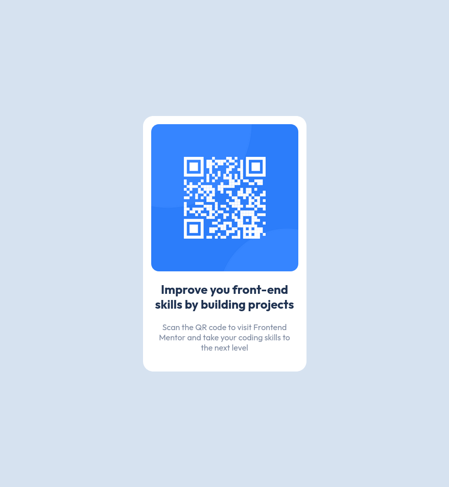

## Overview

- Did this project first but was having issues figuring out how github worked so did a couple more projects after.

### Screenshot

## My process

- Not much to say about the process. Trial and error.

### What I learned

Not much to this one just getting my feet wet. I do know I don't like that I am using the margin values more then once. Still learning how flex and grid work. This one I may be able to just put everything in a div under the qr code to use margin left and right values once.

# Edit

I was advised on this project to use h1 instead of the h2 I had used. I also used :root to set my font-size to 10 for me to use rem easier. I have and have seen advise on using rem's for fonts. I also switched my .container to main as I have also been advised.
thanks for the advice
